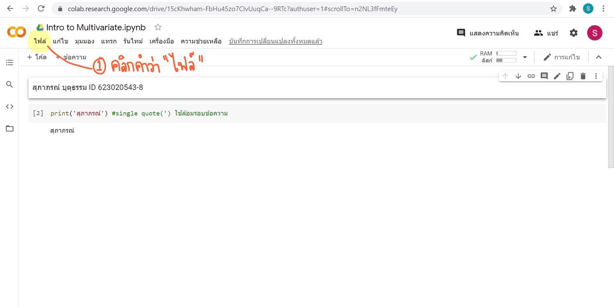
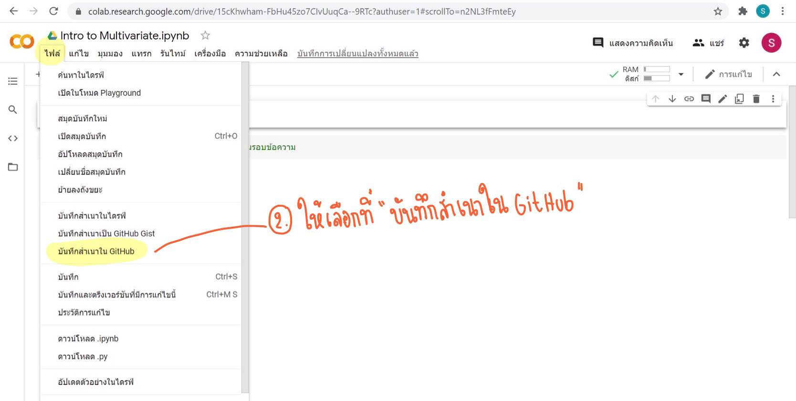
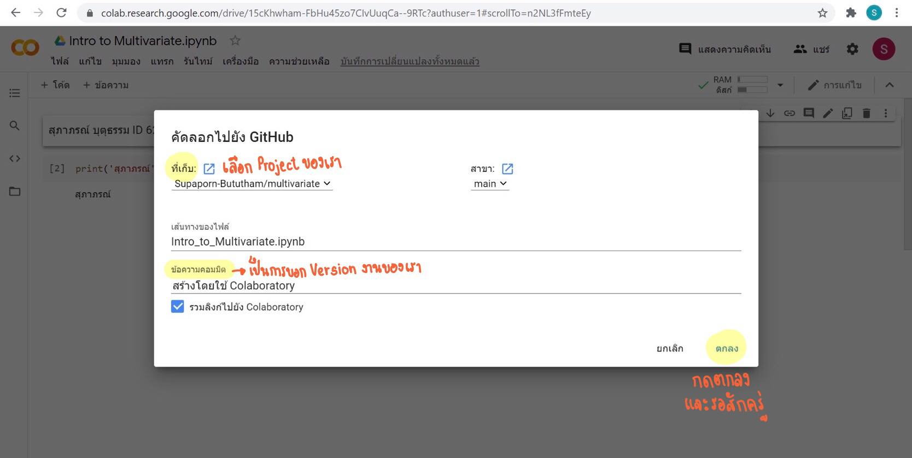
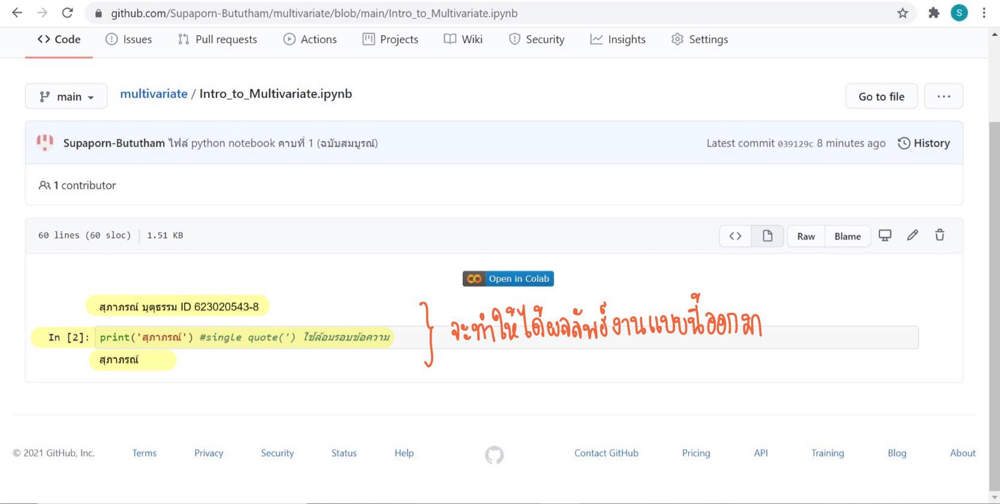

# Multivariate
## สุภาภรณ์ ID 623020543-8

 .md => Markdown
 

 
 
 
 
 
 อธิบายการใช้งาน Github และ Google Colab ว่าหน้าที่แต่ละอันคืออะไร และอธิบายวิธีเซฟไฟล์จาก Google Colab ลงใน Github
 
 GitHub ช่วยให้สามารถพัฒนา code ด้วยกันได้
 
 Google Colab เราสามารถเขียน python ได้บน Browser ได้เลย และ มีส่วนสำคัญ 2 ส่วน คือ Code และ Text
 
 วิธีเซฟไฟล์จาก Google Colab ลงใน Github
 
 1. เลือกคลิกคำว่า "ไฟล์" ใน Google Colab
 
 2. เลือกคลิกคำว่า "บันทึกสำเนาในGitHub" หรือ "Save a copy in GitHub"
 
 3. จากนั้นให้เลือก Project ของเรา และ ใส่ Commit messege เพื่อที่จะบอก Version ของงาน
 
 4. กด "ตกลง" และ ไฟล์งานก็จะโหลดและแสดงข้อมูลบน GitHub
